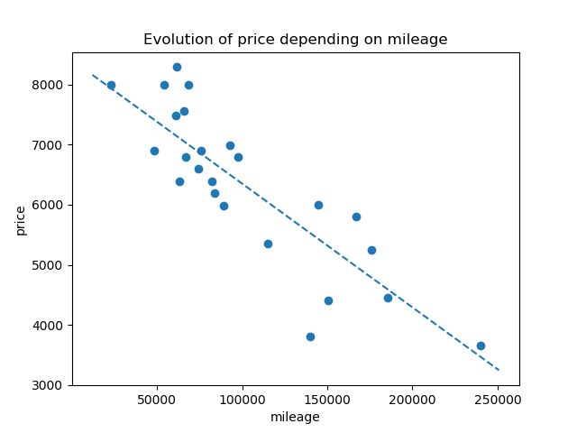

# ft_linear_regression

## Project description

This project objective is to recode a linear regression function in order to predict the price of a car depending on the mileage.

A basic implementation gives us a good evolution of the cost and prediction in approximately 1000 iterations.

Some bonus parts were made during this project :

* data_generator : a data generator script to challenge the performance of the implementation
* regularization : L1 and L2 regularization
* decay rate
* tol : stop the training of the cost does not differ much between 2 iterations
* batch gradient descent (example of cost evolution below)

### Final mark 125/125
